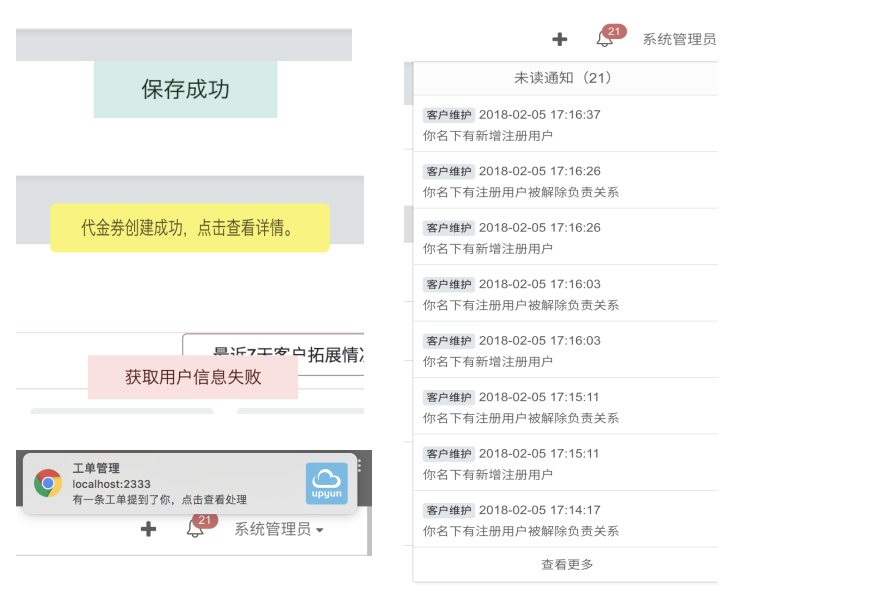
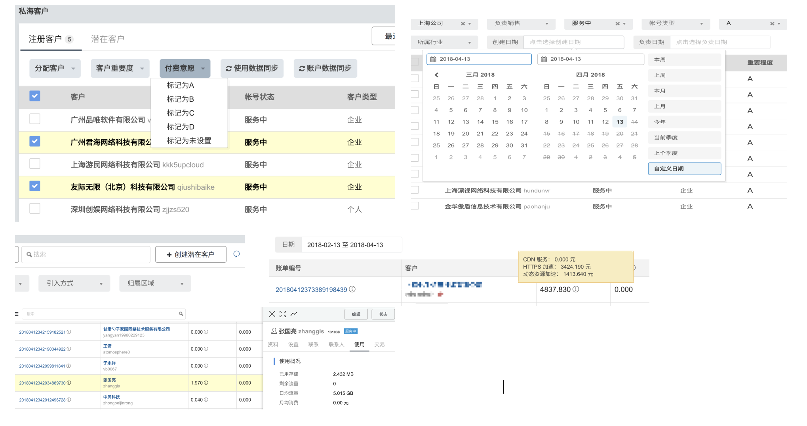
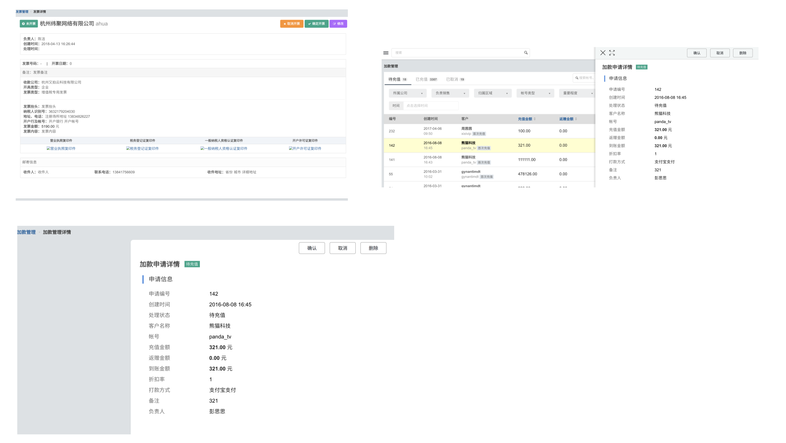
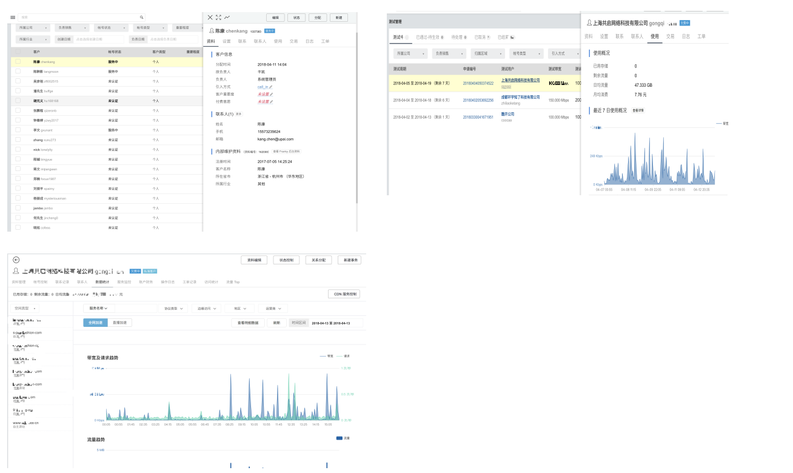
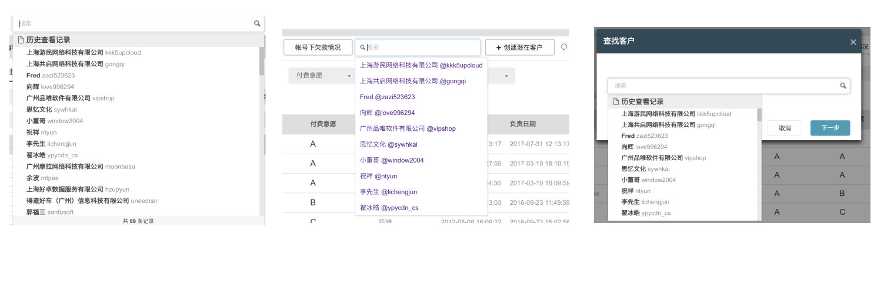
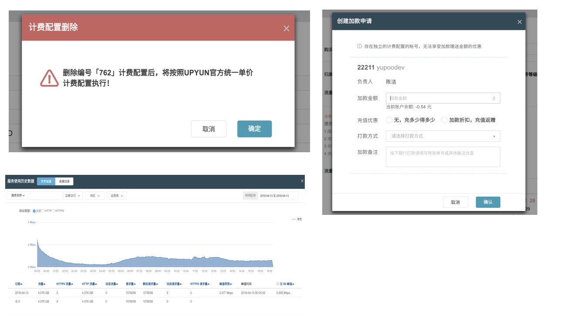
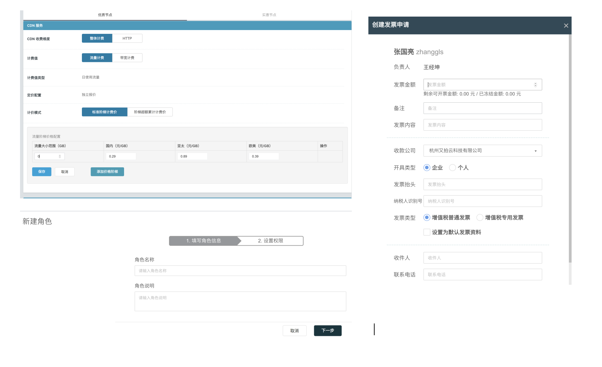
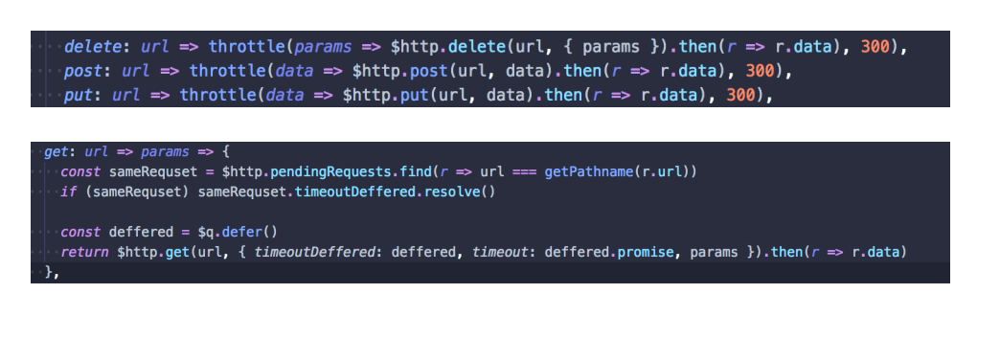
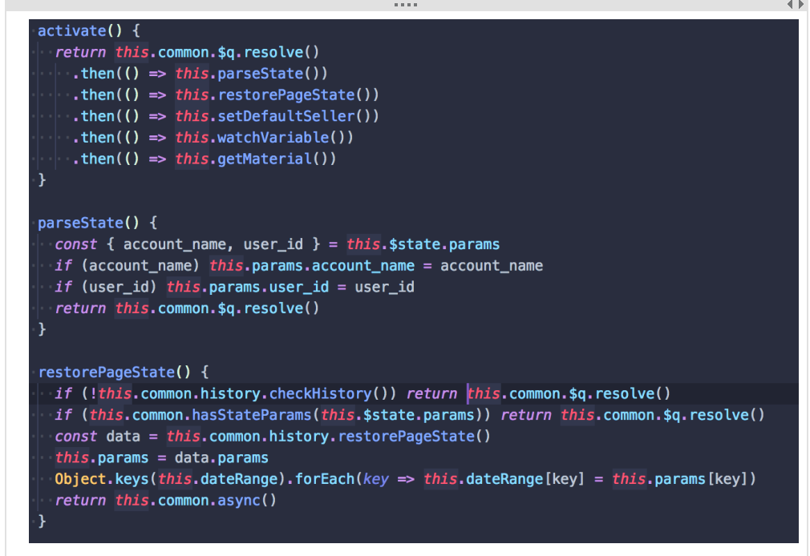

# 代码以及产品以及用户界面设计

## 通知系统

按提醒方式分为，以下几种：

- 纯文本弹出框。主要用于 ajax 的 post delete put 请求的成功或者失败的回调。所有请求均使用 angularjs $http 拦截器，拦截后端返回的错误信息，统一进行错误消息处理，错误文本由后端提供。成功请求根据接口不同分别配置需要显示的文本，文本由前端提供。成功请求弹出框视觉上呈现绿色，点击或 5 秒后消失。失败请求弹出框视觉呈橙色或者红色，考虑到用户需要了解错误信息具体是什么以便进行反馈，所以点击或者 15 秒消失。
- 带有点击回调的弹出框。适用于创建资源类功能的请求，如果该请求配置有单独的详情页，则点击该弹出框的时候前端可以根据后端返回的资源 id 进行路由跳转。方便用户迅速定位自己刚刚创建好的资源。该弹出框呈亮黄色，10 秒后消失。
- 桌面通知。使用 websocket 进行与服务器的实时通信，当浏览器收到新提醒的时候，通过浏览器的桌面通知 api，立即提醒用户处理，可以通过点击该通知，进入到需要处理的页面。新通知到达时，会自动播放一小段铃声提醒，吸引用户的注意。适用场景为新的用户审核，回复提醒等。
- 消息中心模块。桌面通知适用于实时通知，而消息中心模块则用于不需要实时的场景。如用户注册，申请处理等。每次刷新页面时，前端会从后端获取消息列表以检查是否有新消息到达。页面右上角会显示未读消息数量和部分消息列表，点击更多可以进入消息中心模块。
- 邮件提醒。邮件提醒是对消息中心的补充，因为有些用户对该系统使用频率很低，需要使用邮件以确保消息的正确送达。

## 资源列表

信息按资源类型组成了一个个模块。资源汇总在一个列表里面。列表分为两种，一种以客户账号为主键，一种以资源 id 为主键。以客户账号为主键的模块，可以通过勾选账户名，从而进行批量操作，如分配客户，设置重要度等。这是一个通过的组件。大部分列表都可以设置筛选条件过滤客户。右上角会有一个刷新图标，用以清空所有筛选条件。当列表信息过于复杂的时候，可以通过一个悬浮可见的信息框进行展示。大部分列表都可以通过点击客户账号查看客户信息。

## 资源详情

当列表展示不全，需要展示详情页的时候，有两种方案。一种是侧边栏，一种是单独的页面。侧边栏适用与少量数据，所有侧边栏信息框都可以点击扩展为单独页面，以便可以通过资源 id 访问，组件是复用的。复杂数据只通过单独的信息页
展示。

## 客户信息

客户信息是作为一个核心的模块贯穿了整个系统。所以根据我的设计，客户信息可以通过两种维度展示：右侧滑出弹出框和单独的客户信息详情页。其中右侧滑块可以在任意的页面中出现，只需要知道传入一个客户账号名即可，极大的方便了用户操作。客户信息模块里面，包含了以单个客户为维度组织的所有信息，包括财务，使用，联系数据。并且可以通过链接到各个模块，查看所有客户的单项数据为维度的信息。

## 客户搜索框

按功能区分，总共有三种类型的搜索框：全局客户搜索框、列表页客户筛选框、客户选择框。这三种搜索框，均能访问到保存在 localstorage 里面的最近查看的用户列表。全局客户搜索框可以通过点击客户名跳转到相应的信息页。客户筛选框承担着一个通过客户名过滤列表的功能。客户选择框是通用的组件，用于选择需要进行操作的客户。

## 模态框

模态框分为纯粹的信息提示框和信息展示框和具有表单操作的模态框。这在代码层面就已经进行了区分，用以简化代码的复杂度。对于简单的表单都会使用模态框来展示操作，减少用户跳转的操作成本。用户选择的模态框会和具体表单的模态框分离。这样逻辑更清晰，更好复用。不需要复用的模态框的代码（包括 view controller）是内联在 controller 里面的，方便操作。

## 表单

简单表单会通过模态框处理，复杂表单会在单独页面处理，更复杂的表单会分步骤进行处理。

## 防重复提交

全局设置了 post put delete 函数的函数节流----同一个 url 的请求会控制在 300ms 内只能请求一次。特殊情况特殊处理。对于同一 url 的 get 请求，如果上一次同样 url 的 get 请求还在 pendding，则会 canceled 掉前一个请求。此外每一个表单的提交按钮，均会在操作结果未返回的时候，disabled 掉。

## 数据来源

页面数据主要来自于三个方面：ajax 获取，url 传入，本地存储的历史数据。进入一个路由时，会先处理本地存储再处理 url，获得 ajax 参数。

